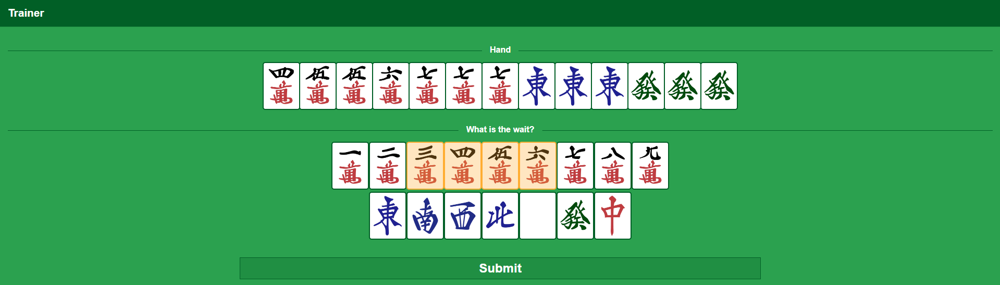

# Riichi Wait Trainer

A web application designed to help you train and identify waits of a tenpai hand in Riichi Mahjong (Japanese Mahjong).



## Links

* [Live Application](https://tools.phil.moe/riichi/wait-trainer)

## Development

This project utilizes Vue.js (3.x) with Vite and Yarn (1.x) for dependency management.

### Getting Started

After cloning the repository, install the necessary dependencies with:

``` bash
yarn
```

### Building the Application

To build the application, run:

```bash
yarn build
```

### Development Mode

To start the application in development mode, use:

```bash
yarn dev
```

### Other Useful Commands

* Run the linter on the code:

```bash
yarn lint
```

### Project Structure

* `/.github/workflows`: Contains .yml configurations for GitHub Actions.
* `/deploy`: Kubernetes .yml configurations for deployment.
* `/dist`: Output folder for builds.
* `/nginx`: NGINX configuration files.
* `/public`: Static assets to be copied during the build process.
* `/src`: Main application code.

## Github Actions

### Continuous Integration

Triggered by commits or pull requests on the master branch. This action verifies that the project builds correctly and adheres to linter specifications.

### Publish

Triggered by the creation of a release. This action builds the application inside a Docker image, pushes it to the image repository, and updates the Kubernetes cluster for automatic deployment of the new release.

## Credits

* Mahjong related components are from [@emeraldcoder/riichi-ui-vue](https://www.npmjs.com/package/@emeraldcoder/riichi-ui-vue)
* Tile images are sourced from [FluffyStuff/riichi-mahjong-tiles](https://github.com/FluffyStuff/riichi-mahjong-tiles)
